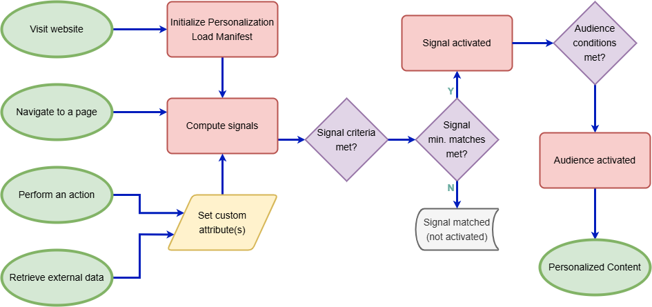

# [](https://www.contensis.com) Contensis Experience Engine [](https://www.typescriptlang.org/)

[]() [](https://cloud.cypress.io/projects/m6esjw/runs) [](https://cloud.cypress.io/projects/m6esjw/runs)

[![Contensis](https://img.shields.io/badge/Contensis-00304d?style=for-the-badge&logoColor=white&logo=data:image/svg%2bxml;base64,PHN2ZyB4bWxucz0iaHR0cDovL3d3dy53My5vcmcvMjAwMC9zdmciIHZpZXdCb3g9Ii02IDAgNjIgNjIiIGhlaWdodD0iMTYiIGZpbGw9Im5vbmUiPjxwYXRoIGZpbGw9IiMzN0JGQTciIGQ9Im00Ny43NjIgMTguNDk0LTMuNjEyLTIuMDZjLjM1OCAxLjY1NS42MzEgMy4yOS43OTkgNC44NTkuMTQ0IDEuMzUzLjM1OCA0LjMwOS4zNTggNC40NXYxOS45NzVjMCAuNDI3LS41MTggMS4zMTEtLjg5MiAxLjUyNkwyNi44OTMgNTcuMjNjLS4xMDkuMDYxLS40NDguMTYtLjg5MS4xNi0uNDQ1IDAtLjc4NC0uMDk5LS44OTItLjE2TDcuNTg2IDQ3LjI0NGMtLjM3Ni0uMjE1LS44OTItMS4wOTktLjg5Mi0xLjUyNlYyNS43NDRjMC0uNDI4LjUxOC0xLjMxMy44OTItMS41MjVsOS43MzEtNS41NDZjMS4xMzQtMS41NDUgMi40MzMtMy4xODkgMy44MjctNC45NTEgMS41NDYtMS45NTUgMy4xODgtNC4wMzYgNC44MzMtNi4yNTgtMS41NDIuMDAzLTMuMDM3LjM3NC00LjIxNiAxLjA0NUw0LjIzOCAxOC40OTdDMS43ODMgMTkuODk1IDAgMjIuOTQ1IDAgMjUuNzQ0djE5Ljk3NGMwIDIuNzk5IDEuNzgzIDUuODQ5IDQuMjM4IDcuMjQ5bDE3LjUyMyA5Ljk4OGMxLjE4Mi42NzUgMi42ODggMS4wNDUgNC4yNCAxLjA0NSAxLjU1IDAgMy4wNTQtLjM3IDQuMjM4LTEuMDQ2bDE3LjUyMy05Ljk4N2MyLjQ1Ni0xLjQgNC4yMzgtNC40NSA0LjIzOC03LjI0OFYyNS43NDRjMC0yLjgtMS43ODItNS44NDgtNC4yMzgtNy4yNVoiLz48cGF0aCBmaWxsPSIjMzdCRkE3IiBkPSJNMjEuNTcxIDUyLjcxM2M1LjA5NC03LjQzOCA3Ljg2Mi0xOC43MDkgOS4xODQtMjUuNzc2LTMuMzQ4IDYuMTYtOS4yMjkgMTUuNjY2LTE2LjQgMjEuNjc4LS4wMzgtLjA2My0uMDYyLS4wMzkgNy4yMTYgNC4wOThaIi8+PHBhdGggZmlsbD0iIzM3QkZBNyIgZD0iTTMzLjIwMi40MTFDMjUuNzQ1IDEzLjAyIDE1LjcyMyAyMS43MjIgMTUuMDkxIDI3LjQ5Yy0uNTkgNS4zODggMS4zNiA5LjgzNyA0LjU1NCAxMi42MDRhODEuMDg2IDgxLjA4NiAwIDAgMCAzLjYxNC00Ljg4Yy0uMDU4LTEuMTE0LS40ODItOS44MTUuNDQtMTIuMjY0LjUyNyAzLjc3OCAxLjYxNiA3LjI2NSAyLjAyIDguNDgzYTExMy45NDggMTEzLjk0OCAwIDAgMCAyLjc0Ni00LjY4NWMtLjA4My0yLjIxMy0uMzEzLTEwLjAwOC40Ni0xMS43OTQuMjA1IDIuNTc1IDEuMTYzIDUuODUyIDEuNzM4IDcuNjM3Ljc2NC0xLjUyMyAxLjE4My0yLjQ1IDEuMTkzLTIuNDcybDIuNzA1LTYuMDE2LS43MSA2LjU0NWMtLjAwNC4wMzQtLjI0MiAyLjE5My0uODIgNS40NzggMS41ODYtMS4yODkgNC4xMDQtMy40NTcgNS4zMjgtNS4xNi4xMDUgMi4wNTQtNC40NDQgNy41NTYtNi4xOTMgOS41OTQtLjE4My44NDktLjM4MiAxLjczLS42IDIuNjM1LS4xNTQuNjQtLjMxMiAxLjI3LS40NzMgMS44OSAxLjUxNy0uODQyIDQuOTkyLTIuODYgNi45MzItNC42OTctLjI5NCAyLjA5NS02LjQ2IDcuNDE5LTguMDkgOC43OTRhODAuMTYxIDgwLjE2MSAwIDAgMS0xLjMzNiAzLjk4YzMuNzQ0LS4yMTMgNy42NzYtMi4xIDEwLjk2OC02LjEzNkM0OS40MDcgMjQuOTYgMzUuNjcyLTMuNzY1IDMzLjIwMi40MTFaIi8+PC9zdmc+)](https://www.contensis.com)
[](https://contensis.slack.com)

Create a personalized experience with Contensis

## How it works

1. Site visitors performing any of the below actions could trigger new signals and activate new audiences within the [Experience Engine Context](https://github.com/contensis/experience-engine/blob/main/packages/experience-engine/docs/EXPERIENCE_ENGINE_CONTEXT.md)

2. Render audience-appropriate content (or fall-back to a default variant)

<br>

<!-- 
_How we identify audiences in order to personalize content_   -->

<figure>
  <picture>
    <source media="(prefers-color-scheme: dark)" srcset="docs/flowchart-dark.png">
    
  </picture>
  <figcaption>How we identify audiences in order to personalize content</figcaption>
</figure>

### What is needed for it to work?

1. Curate signals, audiences and their conditions in Contensis. Publish changes to create the [`Manifest`](https://github.com/contensis/experience-engine/blob/main/docs/MANIFEST.md).
2. [Update your content model](https://github.com/contensis/experience-engine/blob/main/docs/PERSONALIZE_CONTENT.md) to accept multiple variants of specific content fields for different audiences
3. Ensure your project is set up to use one of the `@contensis/experience-engine*` packages configured for your Contensis environment
4. Website components can expect a list of active audiences provided by the [Experience Engine Context](https://github.com/contensis/experience-engine/blob/main/packages/experience-engine/docs/EXPERIENCE_ENGINE_CONTEXT.md) and a list of [content variations curated in Contensis](https://github.com/contensis/experience-engine/blob/main/packages/experience-engine/docs/PERSONALIZE_CONTENT.md)
   - [React package](https://github.com/contensis/experience-engine/blob/main/packages/react/README.md) exports a `useExperienceEngineContext()` hook and additional personalization components

Check out some [Frequently Asked Questions](https://github.com/contensis/experience-engine/blob/main/docs/FAQS.md)

## Project structure

This is a monorepo containing the source code for all of the JavaScript packages that are published to [npmjs](https://www.npmjs.com)

**If you want to use personalization in your project, you should continue reading in one of the following packages' README**

- `/packages`
  - [`/experience-engine`](https://github.com/contensis/experience-engine/blob/main/packages/experience-engine/README.md)
    <br> The standalone personalization package
  - [`/react`](https://github.com/contensis/experience-engine/blob/main/packages/react/README.md)
    <br> The React personalization package
    - **Use this for React projects**

### Test apps

Contains rudimentary personalization examples that can be used to test / evaluate package features, scenarios or specific configuration combinations.

- [`/apps`](https://github.com/contensis/experience-engine/tree/main/apps)

## Installation

Clone this repository, `cd` into the cloned folder and run `npm install`.

Dependencies will be installed for all the packages in the workspace.

#### Example

```bash
git clone https://github.com/contensis/experience-engine.git
 cd experience-engine
npm install
```

## Usage

Build all workspace packages and test apps

```bash
npm run build
```

### Build one package at a time

1. `cd` into the package folder

2. build the package with `npm run build`

```bash
cd packages/experience-engine
npm run build
```

### Launch a test app

1. `cd` into the app folder, e.g. `cd apps/react-router`

2. run the appropriate script from the `scripts` object in the app's `package.json`
   - this is often `npm start`
   - the React projects can be run locally with `npm run dev`

3. check console output success messages and point your browser to the address/port mentioned in the console output e.g. `http://localhost:5173`

#### Example

```bash
cd apps/react
npm run dev
```

## Tests

End to end testing is done with Cypress testing suite

The test suite runs automatically in the CI pipeline after each commit and all tests must pass for a build to complete successfully

### Run tests interactively

Open Cypress and choose a browser to run individual test specs on your local development environment

Use this script when writing or debugging tests

```bash
npm run test:open
```

### Run all tests

Cypress tests will run in the terminal, the test suite will run for all configured browsers (chrome, edge, firefox)

Add a `.env` file to your project containing

```
CYPRESS_RECORD_KEY=<your-cypress.io-record-key>
```

> Remove the `--record` flag in the npm `scripts.e2e:*` commands to skip recording to Cypress cloud

To start the test app server and run all Cypress e2e tests in headless mode for each browser

```bash
npm test
```

## Contributing Guidelines

Contributions are welcome, we accept pull requests from repository forks.

[Conventional commit messages](https://www.conventionalcommits.org/en/v1.0.0/#summary "Contventional Commits") are required in this repository so we can correctly automate changelogs and version increments.

## Technologies

[![Contensis](https://img.shields.io/badge/Contensis-00304d?style=for-the-badge&logoColor=white&logo=data:image/svg%2bxml;base64,PHN2ZyB4bWxucz0iaHR0cDovL3d3dy53My5vcmcvMjAwMC9zdmciIHZpZXdCb3g9Ii02IDAgNjIgNjIiIGhlaWdodD0iMTYiIGZpbGw9Im5vbmUiPjxwYXRoIGZpbGw9IiMzN0JGQTciIGQ9Im00Ny43NjIgMTguNDk0LTMuNjEyLTIuMDZjLjM1OCAxLjY1NS42MzEgMy4yOS43OTkgNC44NTkuMTQ0IDEuMzUzLjM1OCA0LjMwOS4zNTggNC40NXYxOS45NzVjMCAuNDI3LS41MTggMS4zMTEtLjg5MiAxLjUyNkwyNi44OTMgNTcuMjNjLS4xMDkuMDYxLS40NDguMTYtLjg5MS4xNi0uNDQ1IDAtLjc4NC0uMDk5LS44OTItLjE2TDcuNTg2IDQ3LjI0NGMtLjM3Ni0uMjE1LS44OTItMS4wOTktLjg5Mi0xLjUyNlYyNS43NDRjMC0uNDI4LjUxOC0xLjMxMy44OTItMS41MjVsOS43MzEtNS41NDZjMS4xMzQtMS41NDUgMi40MzMtMy4xODkgMy44MjctNC45NTEgMS41NDYtMS45NTUgMy4xODgtNC4wMzYgNC44MzMtNi4yNTgtMS41NDIuMDAzLTMuMDM3LjM3NC00LjIxNiAxLjA0NUw0LjIzOCAxOC40OTdDMS43ODMgMTkuODk1IDAgMjIuOTQ1IDAgMjUuNzQ0djE5Ljk3NGMwIDIuNzk5IDEuNzgzIDUuODQ5IDQuMjM4IDcuMjQ5bDE3LjUyMyA5Ljk4OGMxLjE4Mi42NzUgMi42ODggMS4wNDUgNC4yNCAxLjA0NSAxLjU1IDAgMy4wNTQtLjM3IDQuMjM4LTEuMDQ2bDE3LjUyMy05Ljk4N2MyLjQ1Ni0xLjQgNC4yMzgtNC40NSA0LjIzOC03LjI0OFYyNS43NDRjMC0yLjgtMS43ODItNS44NDgtNC4yMzgtNy4yNVoiLz48cGF0aCBmaWxsPSIjMzdCRkE3IiBkPSJNMjEuNTcxIDUyLjcxM2M1LjA5NC03LjQzOCA3Ljg2Mi0xOC43MDkgOS4xODQtMjUuNzc2LTMuMzQ4IDYuMTYtOS4yMjkgMTUuNjY2LTE2LjQgMjEuNjc4LS4wMzgtLjA2My0uMDYyLS4wMzkgNy4yMTYgNC4wOThaIi8+PHBhdGggZmlsbD0iIzM3QkZBNyIgZD0iTTMzLjIwMi40MTFDMjUuNzQ1IDEzLjAyIDE1LjcyMyAyMS43MjIgMTUuMDkxIDI3LjQ5Yy0uNTkgNS4zODggMS4zNiA5LjgzNyA0LjU1NCAxMi42MDRhODEuMDg2IDgxLjA4NiAwIDAgMCAzLjYxNC00Ljg4Yy0uMDU4LTEuMTE0LS40ODItOS44MTUuNDQtMTIuMjY0LjUyNyAzLjc3OCAxLjYxNiA3LjI2NSAyLjAyIDguNDgzYTExMy45NDggMTEzLjk0OCAwIDAgMCAyLjc0Ni00LjY4NWMtLjA4My0yLjIxMy0uMzEzLTEwLjAwOC40Ni0xMS43OTQuMjA1IDIuNTc1IDEuMTYzIDUuODUyIDEuNzM4IDcuNjM3Ljc2NC0xLjUyMyAxLjE4My0yLjQ1IDEuMTkzLTIuNDcybDIuNzA1LTYuMDE2LS43MSA2LjU0NWMtLjAwNC4wMzQtLjI0MiAyLjE5My0uODIgNS40NzggMS41ODYtMS4yODkgNC4xMDQtMy40NTcgNS4zMjgtNS4xNi4xMDUgMi4wNTQtNC40NDQgNy41NTYtNi4xOTMgOS41OTQtLjE4My44NDktLjM4MiAxLjczLS42IDIuNjM1LS4xNTQuNjQtLjMxMiAxLjI3LS40NzMgMS44OSAxLjUxNy0uODQyIDQuOTkyLTIuODYgNi45MzItNC42OTctLjI5NCAyLjA5NS02LjQ2IDcuNDE5LTguMDkgOC43OTRhODAuMTYxIDgwLjE2MSAwIDAgMS0xLjMzNiAzLjk4YzMuNzQ0LS4yMTMgNy42NzYtMi4xIDEwLjk2OC02LjEzNkM0OS40MDcgMjQuOTYgMzUuNjcyLTMuNzY1IDMzLjIwMi40MTFaIi8+PC9zdmc+)](https://www.contensis.com)      

## License

This project is licensed under the [ISC License](https://opensource.org/licenses/ISC). For detailed terms, please refer to the license file included in this repository.

### Attribution

This project makes use of the following dependencies and data sources, which are governed by separate licenses:

#### 1. [`caniuse-lite`](https://github.com/browserslist/caniuse-lite)

The project indirectly utilizes data from `caniuse-lite` as part of its build tooling. The data, sourced from [caniuse.com](https://caniuse.com), is made available under the **Creative Commons Attribution 4.0 International [(CC BY 4.0)](http://creativecommons.org/licenses/by/4.0/)** license. For more information, visit [the repository](https://github.com/browserslist/caniuse-lite#license).

#### 2. [`spdx-exceptions`](https://github.com/kemitchell/spdx-exceptions.json#readme)

This project indirectly references the `spdx-exceptions` package as part of its build tooling. Portions of the data used are derived from version 2.0 of the SPDX specification, licensed under the **Creative Commons Attribution 3.0 Unported [(CC-BY-3.0)](http://creativecommons.org/licenses/by/3.0/)** license. For details, see [the repository](https://github.com/kemitchell/spdx-exceptions.json#readme).

---
